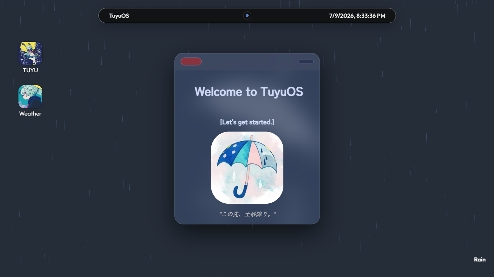

# TuyuOS
A desktop environment based in the browser, inspired by fancy modern operating systems.

## Screenshot


## Demo
Live demo:
https://tuyu-os.vercel.app/

## Features

### Desktop
- Themed desktop inspired by TUYU
- Live clock display
- Custom wallpaper
- Toggleable rain animation (click **Rain** in the bottom right corner)

### Window System
- Draggable windows
- Close, minimize, and restore windows
- Windows stack on top of each other by click order
- Minimized windows collapse into a colored dot in the top bar. Click a dot to restore the window or double-click the app icon to reopen it fresh and clean

### Apps
- TUYU (Biography app, scrollable)
- Weather
  - Live forecasts
  - Dynamic TUYU-inspired weather moods

For more information on the applications:
[APPS INSTRUCTIONS](log/APPS.md)

## Why I made this
I wanted to dive into HTML, CSS, and JavaScript by building something practical, fun, and personal instead of falling into tutorial hell.

## Development
This is my first project of this scale. THroughout development I documented my progress with daily devlogs and screenshots while learning HTML, CSS, and JavaScript.

Within log folder:
[Devlog](log/devlog.md)
[Screenshots](log/screenshots)

## Tech Stack
- JavaScript (Vanilla)
- CSS3
- HTML5
- Open-Meteo API (Weather data)
- Nominatim API (Location search & geocoding)
- Git & GitHub (Version control, hosting)

## Installation
1. Clone the repository.

```bash
git clone https://github.com/CheeseBallad/webOS.git
```

2. Open the project in VS Code.

3. Launch `index.html` using Live Server or open it directly in your browser

## Future Plans
- polish morning glory falls
- Lockscreen
- Music player (TUYU songs)
- smoother animations and elements
- More TUYU!

## Credits
- Some UI elements and aesthetics were inspired by designs I dug through online. I adapted them to fit the primary style of this project.
(Inspired and initially guided with https://jams.hackclub.com/batch/webOS !!)
- rain animation inspired by/adapted from the official TUYU website
- Weather background images derived from official TUYU MVs
- Sun ray effect adapted from [ReactBits SideRays](https://reactbits.dev/backgrounds/side-rays) (MIT License)

## AI usage
- AI tools suchs as Claude and Chatgpt were occasionally used for:
    - brainstorming UI ideas
    - debugging code
    - generating visual inspirations
    - explaining concepts and helping me understand unfamiliar code snippets

AI was used as a learning and assistance tool rather than a code generator. AI was never used to generate the project as a whole.
All code was manually reviewed, modified, and integrated by me. The project's features, architecture, styling decisions, and final implementations were designed, built, and customized by myself.


Horizons Arcana submission!